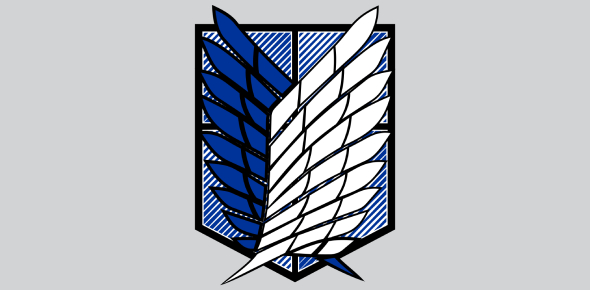

 

# Titan Comics
#### This is a web based application which let users use Image generation AI in the backend to create comic book pages by passing prompts and sharing/downloading the generated page.

## Live Demo
#### This project is deployed on Netlify which you can view at [Titan Comics Website](https://titan-comics-4gj1aij54-tan2191.vercel.app/).

## 🎪 Getting Started
<ul>
  <li>In the root of project folder run : npm install and npm run dev</li>
</ul>
